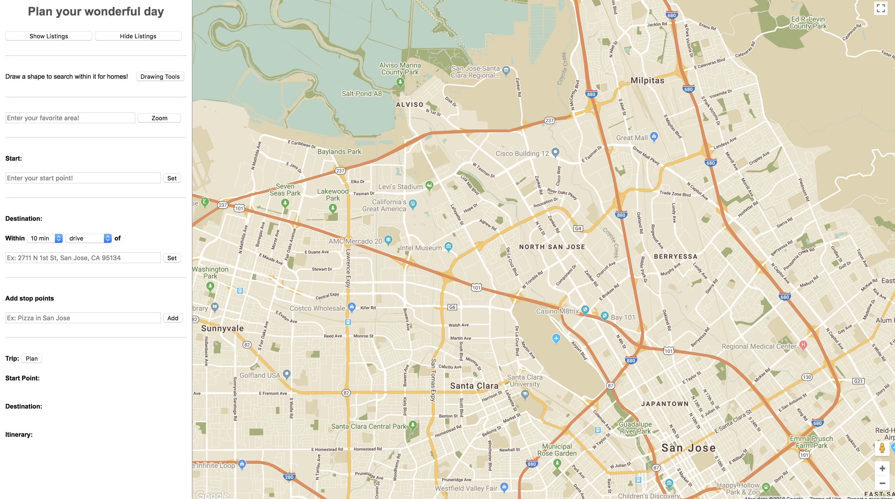

# Travel Smart

## Desciption

The Purpose of TravelSmart is to provide a platform which could be Android, PC or even vehicle end. You use it every time before you start your trip. The entire application is designed to provide user flexibility for finding the shortest and/or time saving path. 

## How to use
For now it is still a single HTML file, you just open it and use it directly.

- **Step 1: Enter your start point**
- **Step 2: Set your destination**
- **Step 3: Add your stops**
- **Step 4: Hit the `Plan` button**
- **Step 5: Have a coffee and enjoy your ride**

